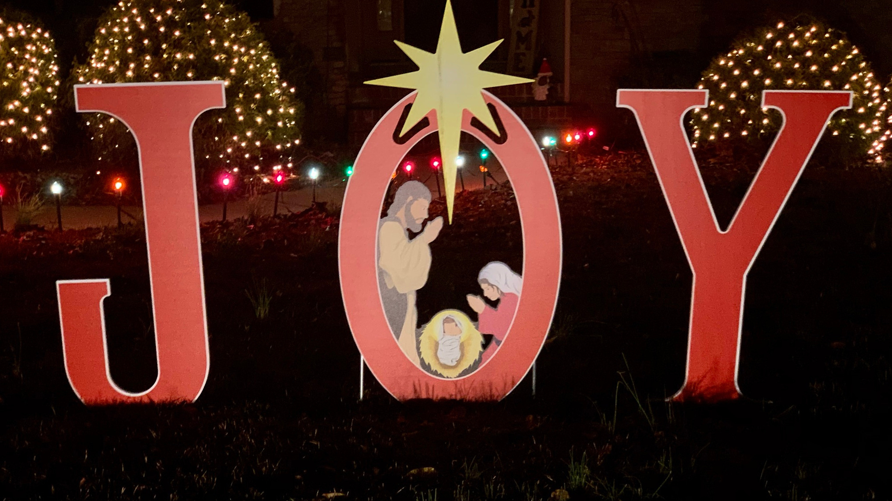

This has been a year that has stretched all of us to the breaking
point.  It started with an impeachment, then really got rolling with
COVID-19, shutdowns, protests and riots across the country, more
COVID, more shutdowns, and the past several weeks we've lived through
all the election drama.  Frankly, it has been a blur.  Time flying by
and yet passing too slowly.  Not content to go out like a lamb, as I
write this on Christmas Day, we all awoke to news of a bomb being set
off in Downtown Nashville.

In light of all that, I­'d like to share a different story for
Christmas.  In Matthew 12:18–21, we read a prophecy from Isaiah:

> Behold my servant, whom I have chosen; my beloved, in whom my soul
  is well pleased: I will put my spirit upon him, and he shall shew
  judgment to the Gentiles.  He shall not strive, nor cry; neither
  shall any man hear his voice in the streets.  A bruised reed shall
  he not break, and smoking flax shall he not quench, till he send
  forth judgment unto victory.  And in his name shall the Gentiles
  trust.

To everyone that is feeling a little battered and bruised, to those
whose light has almost been put out, know this the Lord Jesus was not
sent to break you; he will put out your flame, though it smoulders
low.

Rather, as Isaiah 61 says,

> The Spirit of the Lord G­OD *is* upon me; because the L­ORD hath
  anointed me to preach good tidings unto the meek; he hath sent me to
  bind up the brokenhearted, to proclaim liberty to the captives, and
  the opening of the prison to *them that are* bound; To proclaim the
  acceptable year of the L­ORD, and the day of vengeance of our God;
  to comfort all that mourn ... to give unto them beauty for ashes,
  the oil of joy for mourning, the garment of praise for the spirit of
  heaviness; that they might be called trees of righteousness, the
  planting of the L­ORD, that he might be glorified.

This has been a chaotic and evil year.  One that we all look forward to putting
behind us, but let us not forget the lessons God has taught us.

Evil is real, but God.  God is stronger.  In the midst of all of the
blessings and healing Isaiah lists, there is this, Jesus came to
proclaim not just the acceptable year of the L­ORD, but also "the day
of vengeance of our God".

Evil does not go unpunished.  Although we may not see it and after
2020 it may look like evil has won, it has not.

T­HERE IS H­OPE.  T­HERE IS H­EALING.  T­HERE IS J­OY.

In Jesus of Nazereth are all these things.  Born of a virgin, exalted
of God and dispised of man. Beaten and crucified for our sins, he rose
victorious from the grave that he might offer eternal life and hope to
all.  To give us beauty for ashes. Joy for morning. Praise where there
was heaviness, that we might grow in strength and righteousness,
glorifying God together.

Let us remember that Jesus was born and pray that his will be done and for his
mercy and grace for a better 2021.

With love from our family to yours,

<!-- markdownlint-disable-next-line MD036 -->
*Ron & Cindy Parker*

---

*Smoking Candle* from [Saravanan Photo Art's](https://photoartsaravanan.blogspot.com)
series [Candle & Smoke](https://photoartsaravanan.blogspot.com/2012/12/candle-smoke.html).

*Pine Forest Weymouth Woods SP NC 5211* photo by
[bobistraveling](https://www.flickr.com/photos/bobistraveling/6689471107)
on [flickr](https://www.flickr.com) provided under terms of the [CC BY
2.0](https://creativecommons.org/licenses/by/2.0/) license.
