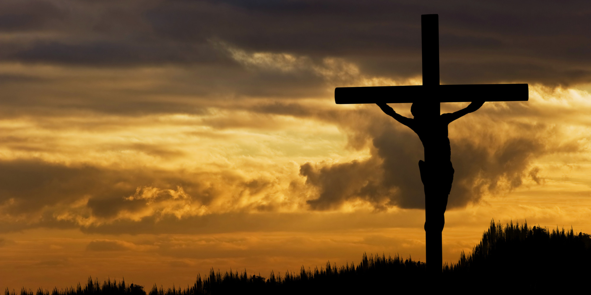

The Bible is incredible even when viewed as simple a story.  It starts off like
a great, galactic space opera, "In the beginning..." with the "heavens and the
earth", the creation of the very universe and it ends with a massive battle,
everything in flames and nearly destroyed, the long promised king returns, and
by the finish everything is set right, the world is restored and there is huge,
magnificent wedding feast filled with celebrants as diverse as the world is
wide.  In between, there are conflicts, massive battles, love and romance, and
the fight for the very soul of man.

The lights go down and the camera zooms in through the darkness to a single, small
world that's the focus of our story.  A beam of light splits the darkness and we
see Earth drawn out of the waters.  Land appears, as grass, herbs and trees begin
to spread across the face of it.  The camera pans upward, stars twinkle into
existence, the Sun and Moon begin to shine.  Like some great James Cameron
movie, days begin to pass by in rapid succession with the Sun setting and rising
as the camera turns and plunges beneath the waters of the ocean and seas, which
begin to teem with life.  Great whales swim by and a voice is heard saying,

> Be fruitful, and multiply...

as the camera breaks the water's surface, birds start to fly, cattle rise forth
from the earth and begin eating the greenest spring grass you've ever seen.
Then, the voice speaks again and it's not Morgan Freeman or James Earl Jones,
their voices are but a pale imitation, and we hear,

> Let us make man in our image, after our likeness: and let them have dominion
  over the fish of the sea, and over the fowl of the air, and over the cattle,
  and over all the earth, and over every creeping thing that creepeth upon the
  earth.

A single, solitary man appears, a woman by his side.  They are beautiful and
perfect, everything Hollywood wishes it could be.

The sun sets and rises again.  All is peaceful and quiet, the couple roams across
face of the earth, birds alighting on shoulders, fingers running through the
manes of lions, lambs cavorting in the fields.

We could stop right there.  And, oh, how we wish we could.  But we are only
on the second page of the story.

A flashback to man's dawn, to his being drawn out of the dust of the earth and
having the breath of life breathed into his lungs. He is handsome and strong.
Yet as he roams among the animals, naming them one by one, the faintest glimmer
of sadness, no not sadness, loneliness is seen in his eyes.

An ephemeral hand touches his forehead, he lays down, and begins to sleep.  A
rib is pulled from his side, and it forms into the most beautiful woman you have
ever seen.  He awakens with her by his side.

They walk on together, smiles on their faces.  The loneliness gone and in its
place a twinkle in both their eyes.

A beautiful garden is planted and they live there happily, walking in the light
of the afternoon with all of God's creation about them, rivers flowing to and
fro with gold and precious stones lying along their banks.  It is all beautiful
and perfect, everything they could ever want.

Except, like Tolkien's *The Lord of the Rings*, there are two exquisite trees.
The Tree of Life and The Tree of the Knowledge of Good and Evil in the midst of
the garden.  With them go a single prohibition, heard coming from that voice
again, saying,

> Of every tree of the garden thou mayest freely eat: But of the tree of the
> knowledge of good and evil, thou shalt not eat of it: for in the day that thou
> eatest thereof thou shalt surely die

We turn the page for only the second time, and the woman happens upon a creature
out of legend, a great red dragon.  Yet there is no fire.  There is no terror.
Instead they begin to speak of God and desire, of power and pride, of
foolishness and knowing better than one's creator.  And there is that tree.

What would it hurt?  Why should any knowledge be forbidden?  What could a
single, simple taste do?

She picks it and bites.  Immediately her lips redden and her beauty fades.  A
great cathedral bell tolls in the distance.

> The Eve of all women has fallen.

Her husband is there now.  He looks at her, a single tear in the corner of his
eye as his stares upon her fallen form.

She turns, offering the fruit to him, to her Adam, a pleading question in her
eye.

He lowers his head and raises it again, a pained look on his face.  He takes the
fruit from her hand and deciding in an instant bites heartily into it.

The cathedral bell tolls again.  Stronger this time.

> Adam, the first of all creation, has fallen.

A third toll.

> Man has fallen ... and with them, all of creation.

As the bell echos on, they turn taking one another's hand and walk away from the
camera as darkness edges in about them.

---

This is but the beginning of the greatest epic ever told.  The first few pages
of an 1,200 page story that will touch the hearts of all who ever live.  A tale
of treachery and loss; a tale of murder most foul; a tale of forgiveness,
redemption, and victory that spans nearly 7,000 years.

But I can't leave you there...

---

The lights come back up.  We see our hero and heroine looking a little worse for
wear, dressed in aprons of fig leaf stitched together, walking through the
garden in morning's clear light, and a voice, that voice calling out,

> Adam, where art thou?

They hide.

We see that same ephemeral hand parting aside the hanging growth where they have
hidden themselves.  An ephemeral face looks in as if to say, "there you are."

Trembling, Adam speaks, “I heard thy voice in the garden, and I was afraid,
because I was naked; and I hid myself."

> Who told thee that thou *wast* naked? Hast thou eaten of the tree, whereof I
> commanded thee that thou shouldest not eat?

This is where the excuses and finger pointing begin. “B-b-but God, the woman
*you* gave me..."

“B-b-but, the serpent beguiled me..."

Meanwhile, the dragon, who has appeared, remains silent.  He's seen this before,
and it didn't end well.

Then, the cursing begins.  Not as you and I cuss and curse.  These literal
curses fall from the lips of God.

The L­ORD God, now wholly revealed in spiritual body and in the fullness of his
power, speaks three imprecations.  He begins first with the dragon,

> Because thou hast done this, thou *art* cursed above all cattle, and above
> every beast of the field; upon thy belly shalt thou go, and dust shalt thou
> eat all the days of thy life...

The great red dragon is seen to shrink, first to a drake and then to a little
wyrm as his color and scales fade, his voice is cutoff, and his wings shrivel
away.  He slinks off through the dust, disappearing into small hole in the
ground, his castings appearing behind him.

God continues on, speaking the second to the woman,

> I will greatly multiply thy sorrow and thy conception; in sorrow thou shalt
> bring forth children; and thy desire *shall* be to thy husband, and he shall
> rule over thee.

Finally, turning to Adam, he speaks the third,

> Because thou hast hearkened unto the voice of thy wife, and hast eaten of the
> tree, of which I commanded thee, saying, Thou shalt not eat of it: cursed *is*
> the ground for thy sake; in sorrow shalt thou eat *of* it all the days of thy
> life; Thorns also and thistles shall it bring forth to thee; and thou shalt
> eat the herb of the field; In the sweat of thy face shalt thou eat bread, till
> thou return unto the ground; for out of it wast thou taken: for dust thou
> *art*, and unto dust shalt thou return.

We then see the L­ORD reach for a lamb.  It is struck down and sacrificed, its
coat turned into proper clothes for the man and his wife.  Blood was spilled and
yet no stain can be seen.  The coats are naught but white and pure.

Gone are the works of their own hands, the fig leaves stitched together to hide
their shame and nakedness, and in their place, coats of skins bought and paid
for by a blood sacrifice offered to and by God from his own hand portraying a
sacrifice to come.  And they faintly understood the second part of God's curse
upon the serpent,

> And I will put enmity between thee and the woman, and between thy seed and her
> seed; it shall bruise thy head, and thou shalt bruise his heel.

And there was hope.

---

Today we celebrate not the death of Jesus of Nazareth, but the resurrection and
ascension into glory of our Lord Jesus Christ, the Lamb of God, which taketh
away the sin of the world.
